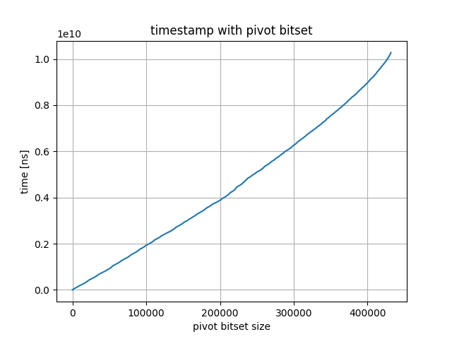

`DIMACS_brock200_2`に対しての各アルゴリズムの実行時間

## Bron-Kerbosch (without pivoting)

### 頂点集合をHashSetで管理

| Command | Mean [s] | Min [s] | Max [s] | Relative |
|:---|---:|---:|---:|---:|
| `cargo run --bin simple_bench without_pivot_hashset` | 59.897 ± 0.894 | 59.140 | 61.794 | 1.00 |

### 頂点集合をBitSetで管理

| Command | Mean [s] | Min [s] | Max [s] | Relative |
|:---|---:|---:|---:|---:|
| `cargo run --bin simple_bench without_pivot_bitset` | 24.959 ± 0.078 | 24.862 | 25.113 | 1.00 |

## Bron-Kerbosch (with pivoting)

### 頂点集合をHashSetで管理

ただし，ピボット選択はランダム

| Command | Mean [s] | Min [s] | Max [s] | Relative |
|:---|---:|---:|---:|---:|
| `cargo run --bin simple_bench with_pivot_hashset` | 23.955 ± 0.217 | 23.571 | 24.241 | 1.00 |

### 頂点集合をBitSetで管理

| Command | Mean [s] | Min [s] | Max [s] | Relative |
|:---|---:|---:|---:|---:|
| `cargo run --bin simple_bench with_pivot_bitset` | 10.066 ± 0.029 | 10.027 | 10.117 | 1.00 |

タイムスタンプ

